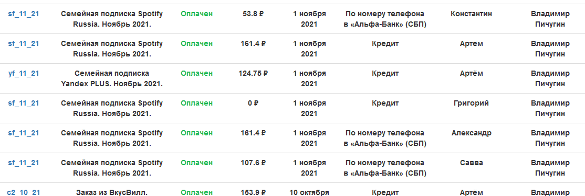
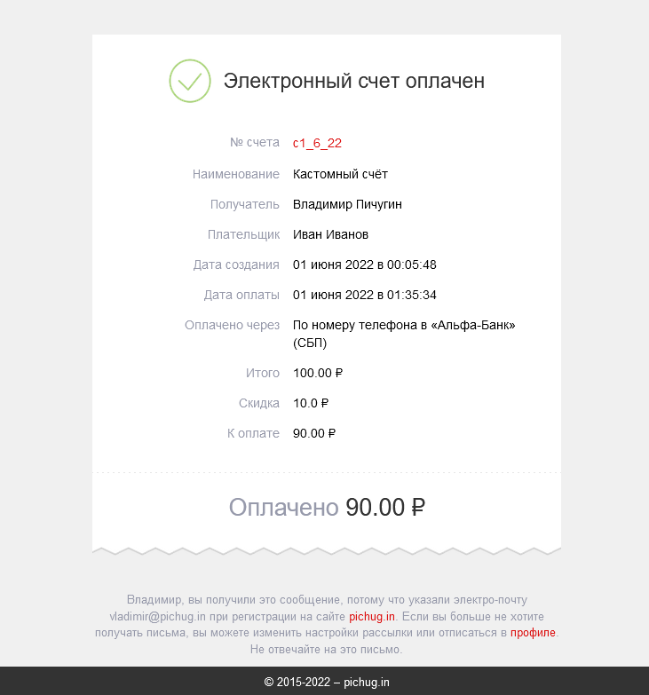

# Invoices Manager

[](https://github.com/vladimirpichugin/invoices_manager/archive/master.zip)

[](https://python.org)
[](https://pypi.org/project/requests)
[](https://pypi.org/project/schedule)
[](https://pypi.org/project/python-dateutil)

***

## Для начала
> **Python 3.10**

Если есть какие-то ошибки при запуске, то первым делом выполнить команду для установки зависимостей
```shell
python -m pip install -r requirements.txt
```
**Пример конфигурации в файле** `settings_example.py`

## Запуск
```shell
python runner.py
```



